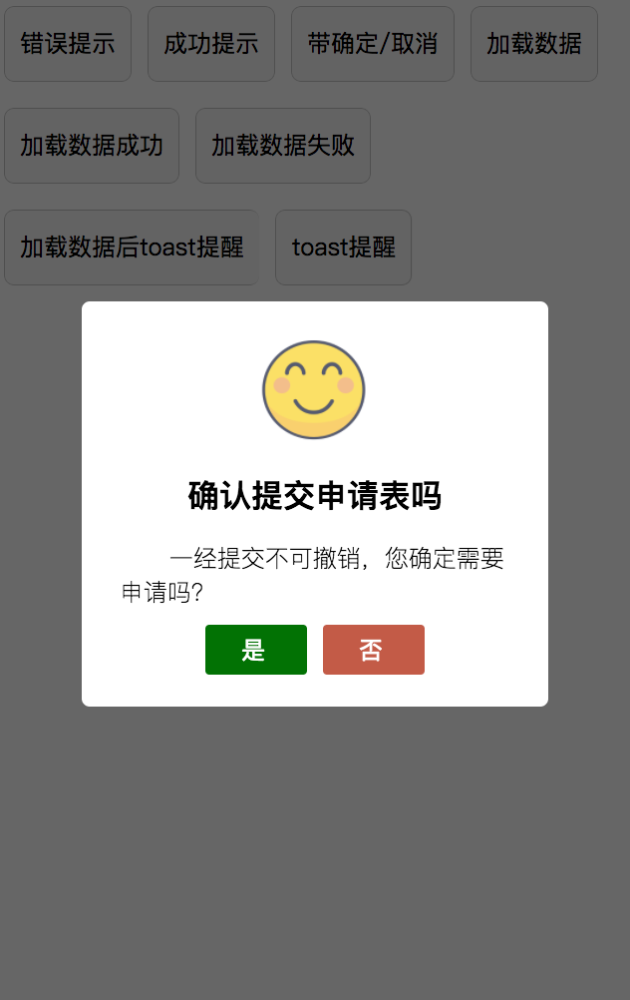
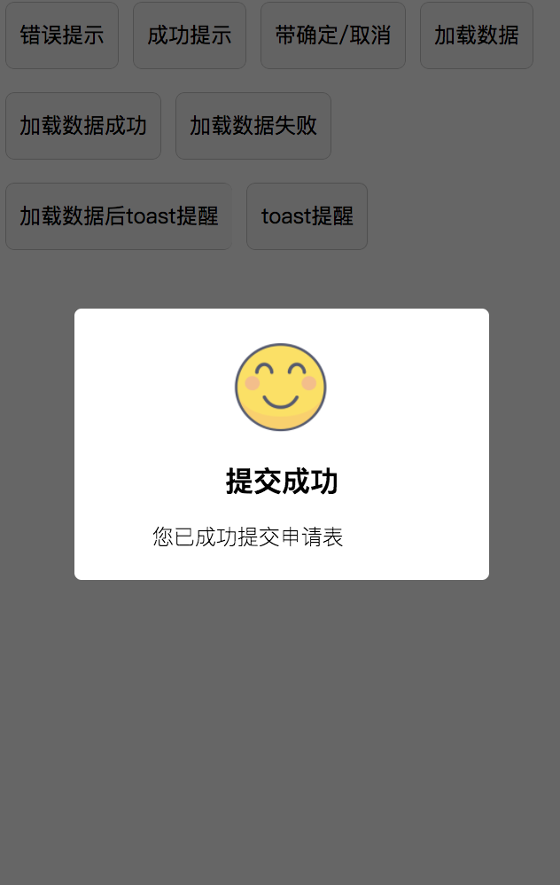
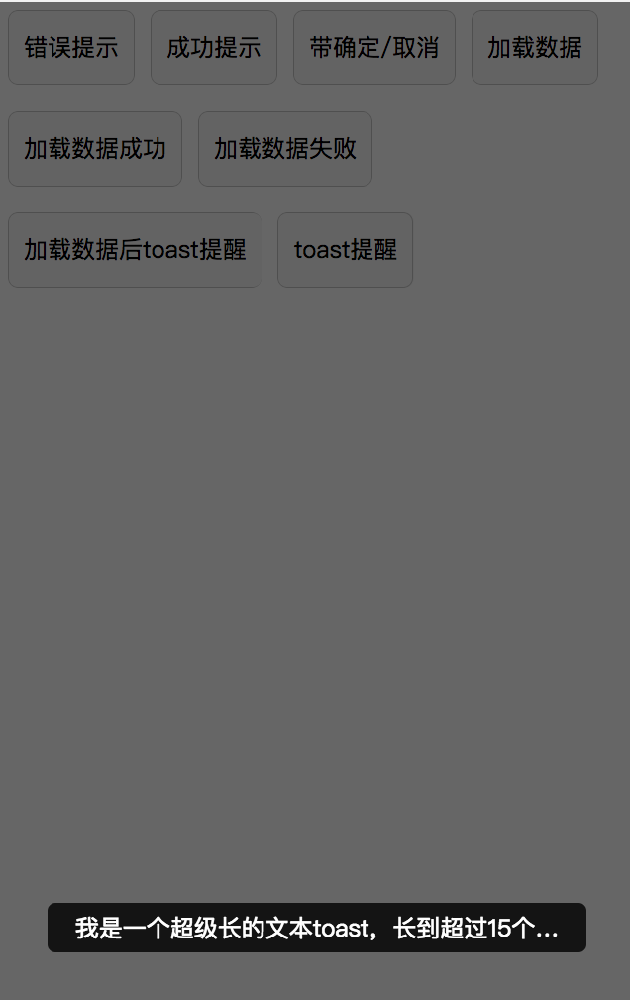

##  如何查看demo

### 1.直接使用开发者打包文件：
####  下载dist文件夹，用微信开发工具打开

### 2.自行编译
```console
  npm install
``` 
```console
  npm run build
``` 
####  然后将dist文件夹用微信开发工具打开


##  关于iviewer

### 主组件：iviewer.wpy

### 辅助组件：iviewerHelper.js
####  组件iviewer写的仓促，所以就写个iviewerHelper作为辅助工具实现哈


##  如何使用iviewer

### 首先强调的是，data保留__wepy_iviewer_settings作为iviewerHelper传递参数


####  1.使用页面需引入组件:
```html
          <iviewer :config.sync="__wepy_iviewer_settings"></iviewer>
```
####  2.页面需配置data:
```html
          '__wepy_iviewer_settings': {}
```
####  3.注意：使用必须传入this


### 效果如下：





####  我也不清楚怎么描述，大家看demo。应该都看的懂，下面简单描述一下iviewer参数

##### type:
######  ["modal","toast"]
##### icon:
######  ["OK","ERR","LOAD","NONE"]
##### title:
######  显示标题 String
##### content:
######  补充说明 String
##### autoClose:
######  自动关闭 Boolean
##### timer:
######  倒计时 Number 【autoClose为true时有效】
##### confirmText:
######  确认文本 String 
##### cancelText:
######  取消文本 String
##### touchCancel:
######  允许触摸关闭弹窗 Boolean【iviewerHelper中loading默认关闭触摸弹窗，需在数据加载完手动关闭】


